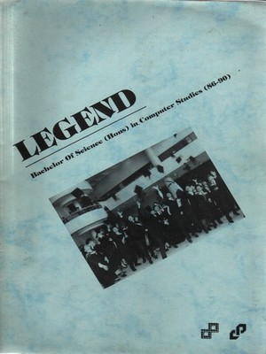

© The Yearbook about Bachelor of Science in Computer Studies, City Polytechnic of Hong Kong, 1990

The year was 1986. It all started inside a commercial building in Mongkok: right on top of the MTR station. I stepped on the escalator and the LEGEND began ....

# Preface

Time Flies ..... nineteen-ninety, nineteen-ninety-one, nineteen-ninety-two, nineteen-ninety-......, now, it has been over two years since we met each other at the graduation ceremony!

But if you are not too forgetful, you should remember that just some time ago, you have paid a small sum of money to the Class Association for the publishing of the yearbook, now named "Legend".

Well, on behalf of the Editorial Board, I would like to apologize for any complaints against us at the Consumer's Council. Don't worry, we have made very good use of your money and you will surely find your contribution's worth of enjoyment in this publication. Now, sit back, relax and have the times of your life revive before your eyes ....

I must take this chance to thank our beloved teachers Dr Balu, Mr. CH Lee, Mr. William Tung and Mr. Bradley Swim in addressing us. The continuous effort and patience of all the members of the Editorial Board must not be forgotten as well:

[b]The Editorial Board[/b]
Chairman: 	Daniel, Gary
Chief Editor & Artwork: 	Alex
General Secretaries: 	Donkey, Geoffrey
Treasurer: 	Victor
Section Editors: 	Micheal, Daniel, Donkey, Geoffrey, Sandy, Victor, Alex, Simon, Authray, Kathy
Chinese support: 	Big Bill, Tommy
Publisher 	City Univerity Of Hong Kong

Ladies and gentlemen, it is my honour to bring to you the long-awaited yearbook of BScCS(86-90) -- the Legend!

Kathy,
for and on behalf of the Editorial Board, 1992

Related:

https://sites.google.com/site/bsccs1990/

